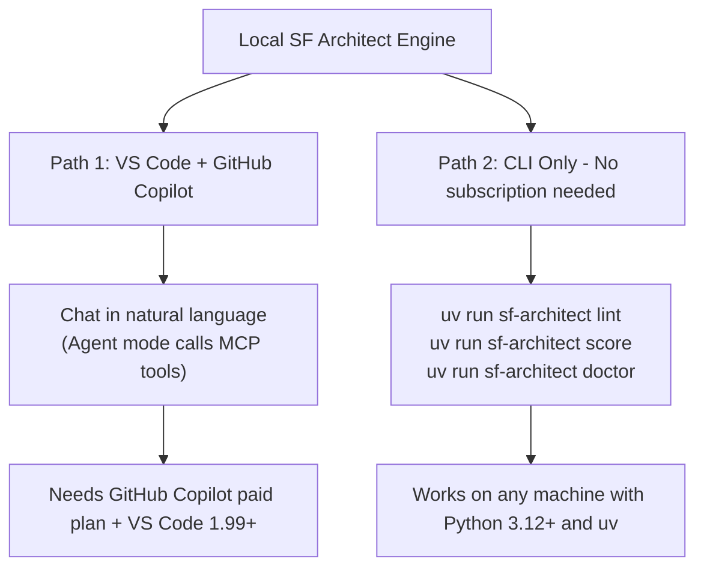

# Using Local SF Architect Engine in VS Code

## Confirmed Verdict

**Yes, you can use this tool in standard VS Code — but with one important condition.**

VS Code added native MCP server support in **version 1.99 (March 2025)**. The tool's MCP server (`sf-architect-mcp`) works in VS Code, but only through **GitHub Copilot's Agent mode**, which requires a paid GitHub Copilot subscription (Individual, Business, or Enterprise).

If you do not have GitHub Copilot, you can still use **every feature through the CLI** — no AI subscription required.

---

## Two Paths Available



---

## Path 1: VS Code + GitHub Copilot (Full AI Chat Experience)

### Prerequisites
- VS Code **1.99 or newer** (check: Help → About)
- GitHub Copilot subscription (Individual $10/mo, Business, or Enterprise)
- GitHub Copilot Chat extension installed in VS Code
- Python 3.12+ and `uv` installed on the machine

### Step 1 — Clone the repo and install dependencies
```bash
git clone https://github.com/personalaimaster-coder/Local_SF_Architect.git
cd "Local SF Architect Engine"
uv sync
```

### Step 2 — First-time setup (once per machine)
```bash
uv run sf-architect doctor
uv run sf-architect doctor --download    # one-time ~130 MB download
uv run sf-architect seed                 # builds local DBs
uv run sf-architect test                 # verify everything passes
```

### Step 3 — Create the VS Code MCP config file

**Critical difference from Cursor:** VS Code uses `"servers"` (not `"mcpServers"`) and the file goes in `.vscode/mcp.json`.

Create `.vscode/mcp.json` inside your SFDX project folder (or any workspace you open):

```json
{
  "servers": {
    "sf-local-architect": {
      "command": "uv",
      "args": ["run", "sf-architect-mcp"],
      "cwd": "/absolute/path/to/Local Salesforce Architect Engine"
    }
  }
}
```

Replace `cwd` with the actual path where you cloned/copied the project on that machine.

**Windows example:**
```json
"cwd": "C:\\Users\\YourName\\Documents\\Local Salesforce Architect Engine"
```

This file can be committed to your SFDX repo so every team member automatically gets the config when they open the project.

### Step 4 — Enable Agent mode in VS Code

1. Open VS Code Settings (`Ctrl+,` / `Cmd+,`)
2. Search for `chat.agent.enabled` and set it to `true`
3. Open Copilot Chat (`Ctrl+Shift+I`)
4. Switch the chat mode dropdown from **Ask** to **Agent**
5. Run Command Palette (`Ctrl+Shift+P`) → `MCP: List Servers` — confirm `sf-local-architect` shows as running

### Step 5 — Use it

Open your SFDX project in VS Code, switch Copilot Chat to Agent mode, and ask questions:

- *"What breaks if I refactor AccountService.cls?"*
- *"I'm running a SOQL query on 45,000 records. Will I hit governor limits?"*
- *"What is the best pattern for async Salesforce processing?"*
- *"Score the architecture health of this project"*
- *"Draw me a dependency diagram for the Order subsystem"*

---

## Path 2: CLI Only (No Subscription Needed)

Every feature is also available as a standalone terminal command. Open VS Code's integrated terminal (`Ctrl+\``) and run from your SFDX project root:

| What you want to do | Command |
|---|---|
| Lint all Apex for anti-patterns | `uv run sf-architect lint /path/to/sfdx-project` |
| Get architecture health score | `uv run sf-architect score /path/to/sfdx-project` |
| Check environment health | `uv run sf-architect doctor` |
| Rebuild all local databases | `uv run sf-architect rebuild` |

Exit code `1` is returned when lint violations are found — making this CI/CD pipeline compatible.

---

## Key Differences: VS Code vs Cursor Config

| | Cursor | VS Code |
|---|---|---|
| Config file location | `~/.cursor/mcp.json` | `.vscode/mcp.json` in workspace |
| Root key name | `"mcpServers"` | `"servers"` |
| AI requirement | Built-in (no extra subscription for basic use) | GitHub Copilot subscription required for Agent mode |
| MCP tool access | Cursor AI chat | Copilot Chat in Agent mode |

---

## Moving to a Different Machine — Checklist

- Install Python 3.12+ and `uv`
- Clone the repo (or copy the folder)
- Run `uv sync` inside the project folder
- Run `uv run sf-architect doctor --download` (internet needed once)
- Run `uv run sf-architect seed`
- Update `cwd` in `.vscode/mcp.json` to the new path on that machine
- Restart VS Code; verify in Command Palette → `MCP: List Servers`
