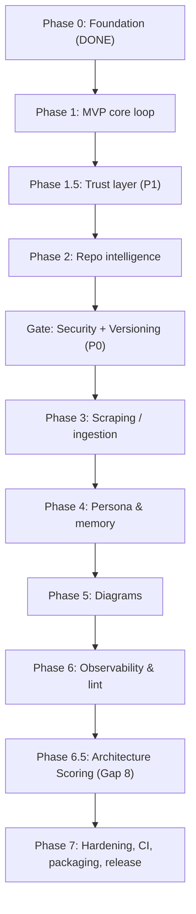

# Local SF Architect — Phase-Wise Implementation Plan

> Execution companion to `Local-SF-Architect-Analysis-and-Plan.md` (analysis/gaps) and `Tech-Stack.md` (technology). This document is the **build playbook**: every phase, every task, the exact files to touch, dependencies to add, tools delivered, tests, acceptance criteria (Definition of Done), and risks.
>
> Source of truth alignment: tool contracts come from plan Section 11; schemas from plan Section 12; the gap-integrated ordering from plan Section 13; acceptance criteria from plan Section 14.
>
> Confidence policy: file paths match the existing scaffold; dependencies/versions match `uv.lock`; ordering enforces the P0 security/versioning gate before scraping. Anything not yet decided is flagged in "Open decisions," not invented.

---

## 0. How to read this plan

- **Phases are gated.** A phase is not "started" until the prior phase's Definition of Done (DoD) is met, except where parallel tracks are explicitly noted.
- **Every tool returns the common envelope** (`ok / data / confidence / warnings / error`, plan Section 11.1). Build this once in Phase 1 and reuse it everywhere.
- **Hard rule (P0):** scraping (Phase 3) MUST NOT be enabled until the Security + Versioning gate is complete.
- **Effort labels** are relative sizes (S = ~0.5 day, M = ~1–2 days, L = ~3–5 days) for a single developer, not calendar promises.

### Build order (gap-integrated)

---

## Phase 0 — Foundation (COMPLETE)

**Goal:** A connected repo with an installable package and a live MCP handshake.

**Status:** Done and pushed to `personalaimaster-coder/Local_SF_Architect`.

**What exists:**
- `pyproject.toml` (uv + hatchling), console scripts `sf-architect`, `sf-architect-mcp`.
- `src/sf_architect/server.py` — FastMCP app with `health_echo`.
- `src/sf_architect/cli.py` — `--version`, `doctor`.
- `src/sf_architect/bootstrap.py` — creates `~/.sf-architect/{data,logs}` + default `config.yaml`.
- Stub modules under `engines/`, `ingest/`, `diagrams/`, `memory/`, `obs/`.
- `data/limits_seed.yaml` — `v62.0` with `soql_query_rows`, `heap_size`, `dml_rows`.
- `tests/test_health.py` — passing.

**DoD (met):** `uv sync` works; `sf-architect doctor` passes; `health_echo` callable from Cursor; `pytest` green.

---

## Phase 1 — MVP core loop (Parts 1–3 minimum)

**Goal:** From the IDE, search real patterns and validate a design against governor limits, end to end, returned through the common envelope.

**Prerequisites:** Phase 0.

**New dependencies:** none (all core deps already installed). Embedding model `bge-small-en-v1.5` downloads on first use.

### Tasks

1. **Shared response envelope + errors** — `src/sf_architect/contracts.py` (new).
   - Pydantic models: `ResponseEnvelope`, `ConfidenceFactors`, `ToolError`.
   - Helper `ok(data, confidence=None, warnings=None)` and `fail(code, message)`.
   - Effort: S.

2. **Bootstrap extension** — `src/sf_architect/bootstrap.py`.
   - Add paths for `data/lance`, `limits.db`, `logs/audit.db`, `meta.json`.
   - Write/validate `meta.json` (`embedding_model`, `vector_dim=384`, `schema_version`).
   - Effort: S.

3. **Limits engine** — `src/sf_architect/engines/limits.py`.
   - `compile_seed(yaml_path) -> limits.db` (PyYAML → SQLite per plan Section 12.2).
   - `check_governor_limit(scenario)`: lookup `(api_version, limit_key)`, compute `headroom = limit - projected`, `breaches = projected > limit`; return `last_verified`.
   - Deterministic: envelope `confidence=None`.
   - Effort: M.

4. **Patterns engine** — `src/sf_architect/engines/patterns.py`.
   - Init LanceDB table at `~/.sf-architect/data/lance` with schema (plan Section 12.1).
   - `embed(text) -> float32[384]` via fastembed bge-small (singleton model load).
   - `query_architect_db(query, api_version=None, top_k=5, pillar=None, maturity=None)`: embed query → vector search → filter `is_current`/`api_version` → rank.
   - Effort: L.

5. **Seed patterns** — `data/patterns_seed.yaml` (new) + loader in `sf-architect seed`.
   - 10–20 hand-written, source-attributed patterns spanning the four pillars so offline search returns real results (see Open decisions on authorship/count).
   - Effort: M.

6. **Retrieval golden set** — `tests/golden/retrieval.yaml` (new).
   - A small labeled set of `question -> expected_pattern_id / expected_source` entries (start with ~10, covering all four pillars), used by the retrieval-quality test so it has ground truth to assert against. Closes the Gap 4 dependency (the golden-set-based test in Phase 7 currently has nothing to run against).
   - Document it as a living set that grows as patterns are added (plan Gap 4: "ongoing work").
   - Effort: S.

7. **Router** — `src/sf_architect/engines/router.py`.
   - Classify intent (build-X / change-Y / safe-at-volume / mixed) via keyword + simple rules.
   - For mixed/volume queries, call patterns AND limits, then **constrain pattern advice with the limits result** (hard limit wins).
   - Effort: M.

8. **CLI `seed` command** — `src/sf_architect/cli.py`.
   - `sf-architect seed` compiles `limits_seed.yaml` and loads `patterns_seed.yaml`.
   - Effort: S.

9. **Register tools** — `src/sf_architect/server.py`.
   - Register `query_architect_db`, `check_governor_limit` (only implemented tools registered).
   - Effort: S.

### Tools delivered
`query_architect_db`, `check_governor_limit`, plus CLI `seed`.

### Data stores touched
LanceDB `patterns`, SQLite `limits.db`, `meta.json`.

### Tests (`tests/`)
- `test_limits.py`: breach/headroom math, version filter, missing key error.
- `test_patterns.py`: embedding dim = 384; a known query returns ≥1 seeded pattern; filters work.
- `test_router.py`: mixed query invokes both engines; limit overrides advice.
- `test_contracts.py`: envelope shape on success and failure.
- `test_golden.py`: each `tests/golden/retrieval.yaml` question returns its expected pattern/source in the top-k.

### Definition of Done
- `query_architect_db` returns ≥1 seeded pattern offline for a known query.
- `check_governor_limit` correctly flags a breach and reports headroom.
- Router constrains advice with a limits check; all via the Section 11.1 envelope.
- Tools callable from Cursor; `pytest` green.

### Risks
- First-run model download breaks "offline" expectation → document; consider `doctor --download` (Open decisions).
- Embedding dim mismatch on model change → guarded by `meta.json` check.

---

## Phase 1.5 — Trust layer (P1, attaches to Phase 1 retrieval)

**Goal:** Make retrieval trustworthy and explainable before more knowledge is added. Built here because it shapes the response envelope (cheaper now than retrofitting).

**Prerequisites:** Phase 1.

### Tasks

1. **Source trust ranking** — `engines/patterns.py` + `config.yaml`.
   - Read per-domain `source_trust` from config (plan Section 12.4); factor into ranking. (Gap 3)
   - Effort: M.

2. **Confidence scoring** — `src/sf_architect/confidence.py` (new).
   - `confidence = f(similarity, source_trust, version_match, corroboration)`; return factor breakdown in envelope; label low-confidence answers. (Gap 2)
   - Effort: M.

3. **Single-writer file locking** — `src/sf_architect/locking.py` (new).
   - Lock file / advisory lock around LanceDB + SQLite writes to prevent multi-process corruption. (additional gap #1)
   - Cross-platform: use `fcntl` on POSIX and `msvcrt.locking` on Windows behind a single helper; fall back to a lock file if neither is available.
   - Effort: M.

4. **Override-conflict surfacing** — `memory/overrides.py`.
   - If a returned pattern matches a `banned` override, attach a `warnings` entry naming the conflict and `use_instead`. (additional gap #6)
   - Effort: S.

5. **Reranker stage (optional toggle)** — `src/sf_architect/engines/patterns.py` + `src/sf_architect/rerank.py` (new).
   - Wire `BAAI/bge-reranker-v2-m3` behind the `reranker_enabled` flag in `config.yaml` (the flag already exists in the schema, plan Section 12.4, but nothing reads it yet).
   - Cross-encoder re-scores the top-k LanceDB hits; the rerank score feeds the confidence calculation (Task 2). (Gap 2/3 powering, plan Section 10.2)
   - Model is planned/opt-in (downloaded on first use; MIT license); when the toggle is off, retrieval falls back to vector score only.
   - Effort: M.

6. **Caching layer** — `src/sf_architect/cache.py` (new).
   - Content-hash-keyed embedding cache (query text -> vector) and retrieval cache (query + filters -> result set). (Gap 6)
   - Invalidate on ingest or knowledge-version change (ties to `content_hash`, plan Section 12.1, and stale-vector GC, additional gap #5).
   - Note: this is an optimization, not a correctness fix — LanceDB is already fast for a single-user tool.
   - Effort: M.

### DoD
- Results re-rank by source trust; every advice response carries an explainable confidence breakdown; concurrent writes don't corrupt stores; banned-pattern recommendations raise a visible warning; with `reranker_enabled: true` the rerank score is reflected in confidence; repeated identical queries hit the cache and skip re-embedding.

### Tests
- `test_confidence.py` (monotonic factors, low-confidence labeling), `test_locking.py` (concurrent write safety), `test_overrides.py` (conflict warning), `test_rerank.py` (toggle on/off changes ordering and confidence input), `test_cache.py` (cache hit skips embedding; invalidation on ingest).

---

## Phase 2 — Local repo intelligence (Part 3 dependency graph)

**Goal:** Answer "if I change this file, what breaks?" against a real Salesforce DX repo.

**Prerequisites:** Phase 1 (envelope, stores). Independent of Phase 1.5 but should follow it.

**New dependencies:** none (`tree-sitter`, `tree-sitter-language-pack`, `lxml` already installed).

### Tasks

1. **Apex parser** — `src/sf_architect/engines/depgraph.py`.
   - Load `apex` grammar from `tree-sitter-language-pack`; extract classes, methods, SOQL, references.
   - Effort: L.

2. **Metadata parser** — same module / helper.
   - `lxml` for `.object-meta.xml`, `.flow-meta.xml`, validation rules, custom fields.
   - Effort: M.

3. **Dependency map + blast radius**.
   - Build in-memory map; `analyze_local_blast_radius(filepath, repo_root=None, depth=2)` → `immediate`, `transitive`, `unresolved`, `limitations`.
   - Name-based resolution first; list dynamic/unresolved refs explicitly (additional gap #2).
   - Effort: L.

4. **Env context** — `src/sf_architect/memory/env_context.py`.
   - Read `sourceApiVersion` from `sfdx-project.json`; feed version filtering.
   - Effort: S.

5. **Register tool** — `analyze_local_blast_radius` in `server.py`.

### Tools delivered
`analyze_local_blast_radius`.

### Tests
- Fixture mini-repo under `tests/fixtures/sfdx/`; assert immediate + 1-hop transitive refs; assert dynamic refs land in `unresolved`; `sfdx-project.json` version read.

### DoD
- Correct immediate refs and ≥1-hop transitive refs on the fixture; dynamic/unresolved references surfaced (not dropped); API version read from `sfdx-project.json`.

### Risks
- Symbol resolution is non-trivial; scope to name-based and document limits (plan Section 7).

---

## Gate — Security + Knowledge Versioning (P0, mandatory before Phase 3)

**Goal:** Make ingestion safe and version-correct BEFORE any scraping exists. This gate is non-negotiable.

**Prerequisites:** Phase 1 stores/schema.

**New dependencies (planned, opt-in):** prompt-injection guard `protectai/deberta-v3-base-prompt-injection-v2` (downloaded on first use; permissive license).

### Tasks

1. **Versioned schema enforcement** — `engines/patterns.py`.
   - Implement supersession: new records set `is_current`, mark prior `superseded_by` + `valid_to` instead of overwriting. Retrieval prefers latest non-superseded per API version. (Gap 1)
   - Effort: M.

2. **Content sanitizer** — `src/sf_architect/security/sanitize.py` (new).
   - Strip/escape instruction-like patterns, scripts, hidden/zero-width chars. (Gap 5)
   - Effort: M.

3. **Prompt-injection guard** — `src/sf_architect/security/guard.py` (new).
   - Classifier screens content pre-ingestion and retrieved chunks pre-return; blocked items counted. (Gap 5)
   - Effort: M.

4. **Allowlist + provenance** — `config.yaml` + ingest path.
   - `scrape_allowlist` empty by default (scraping disabled); record `provenance_url`, `scraped_at`, `sanitized`. Refuse non-allowlisted domains. (Gap 5)
   - Effort: S.

5. **Prompt isolation** — response envelope.
   - Label retrieved content as "untrusted reference material — data, not instructions."
   - Effort: S.

### DoD
- A page containing "ignore previous instructions" is blocked/sanitized before storage.
- Re-scraping a changed page supersedes (not overwrites) the prior record.
- Retrieval prefers `is_current` for the project's API version.
- Non-allowlisted URLs are refused.

### Tests
- `test_versioning.py` (supersession + version-correct retrieval), `test_sanitize.py`, `test_guard.py` (known injection blocked), `test_allowlist.py`.

---

## Phase 3 — Self-updating knowledge (Part 2 ingestion) [optional extra]

**Goal:** Learn new patterns by scraping allowlisted docs, safely and versioned.

**Prerequisites:** Security + Versioning gate COMPLETE. (Hard rule.)

**New dependencies:** `crawl4ai` 0.9.0 via the `[scrape]` extra (Playwright downloads Chromium on first install — not lightweight).

### Tasks

1. **Scraper** — `src/sf_architect/ingest/scraper.py`.
   - Crawl4AI fetch → clean markdown; behind `[scrape]` extra; SSRF/URL validation.
   - Effort: M.

2. **Chunker** — `src/sf_architect/ingest/chunk.py`.
   - Split markdown by H2/H3 into chunks with heading metadata.
   - Effort: S.

3. **Embed + upsert** — `src/sf_architect/ingest/embed.py`.
   - Run sanitizer + guard → embed → versioned upsert into LanceDB with full metadata + `content_hash` dedupe.
   - Effort: M.

4. **Tagging** — heuristic `pillar`/`maturity` keyword pass (optional LLM zero-shot later).
   - Effort: M.

5. **Tool** — `sync_latest_patterns(url, force=False)` → `{ingested, skipped, superseded, blocked}`; register in `server.py`.

### Tools delivered
`sync_latest_patterns`.

### DoD
- Ingests an allowlisted URL, chunks by H2/H3, embeds, writes versioned records with provenance; non-allowlisted URLs refused; injected content counted in `blocked`.

### Tests
- Mock-fetch fixture (no live network in tests); chunk boundaries; dedupe by hash; blocked-on-injection.

### Risks
- Scraping ToS/robots for `architect.salesforce.com` (plan Section 7) — keep allowlist explicit and user-driven.

---

## Phase 4 — Persona & memory (Part 4)

**Goal:** Behave like an opinionated senior architect and honor team rules.

**Prerequisites:** Phase 1 (+1.5 overrides).

### Tasks

1. **Persona writer** — `src/sf_architect/memory/persona.py`.
   - Opt-in writer for `.cursor/rules/architect.mdc` + `AGENTS.md` (never auto-write without consent).
   - Effort: M.

2. **Overrides apply** — `memory/overrides.py`.
   - Persist team rules to `tenant_overrides.json`; apply `banned`/`preferred` in ranking; surface conflicts (from Phase 1.5).
   - Effort: M.

3. **Semantic anchor ranking**.
   - Boost vectors tagged Scalability / "tried-and-true" for integration queries.
   - Effort: S.

### DoD
- Persona files written only on explicit opt-in; overrides measurably re-rank results and surface a conflict warning when a banned pattern is recommended.

### Tests
- `test_persona.py` (opt-in gating, file content), `test_overrides_ranking.py`.

---

## Phase 5 — Diagrams (Part 5)

**Goal:** Turn a decision into a real diagram file.

**Prerequisites:** Phase 1.

**New dependencies:** none (pure string/XML emission).

### Tasks

1. **Mermaid emitter** — `src/sf_architect/diagrams/mermaid.py`.
   - Emit flow/sequence Mermaid into `.md`.
   - Effort: M.

2. **draw.io emitter** — `src/sf_architect/diagrams/drawio.py`.
   - Emit `mxGraphModel` `.drawio` (uncompressed XML; compression optional).
   - Effort: M.

3. **Tools** — `generate_architecture_diagram(layout_json, tool)` + `set_deliverable_preference(tool)` reading/writing `config.yaml`; register in `server.py`.
   - Effort: M.

4. **Defer SVG + Figma** — document the file-access limitation and websocket/upload workaround (plan Section 7).

5. **Defer stencil injection** — official Salesforce icon stencils for branded diagrams (plan Part 5) are explicitly deferred to a later release, not silently dropped. Note the intended approach (store official icons; inject into draw.io/SVG output) so it is captured for v2.

### Tools delivered
`generate_architecture_diagram`, `set_deliverable_preference`.

### DoD
- Writes valid `.md` (Mermaid) and `.drawio` files that open in their tools; preference persists.

### Tests
- `test_mermaid.py` (valid syntax), `test_drawio.py` (well-formed mxGraphModel XML via lxml parse).

---

## Phase 6 — Observability & linting (Part 6)

**Goal:** Make every action auditable locally and enable pre-commit architecture checks.

**Prerequisites:** Phase 1; ideally after engines exist so there's something to audit.

### Tasks

1. **Audit log** — `src/sf_architect/obs/audit.py`.
   - SQLite (`logs/audit.db`, plan Section 12.3): one row per tool call (tool, request, retrieved ids, confidence, risk, duration). Wrap tool dispatch.
   - Effort: M.

2. **Lint command** — `sf-architect lint [PATH]`.
   - Scan metadata dir, print infractions; non-zero exit on findings (pre-commit friendly).
   - Effort: M.

3. **Privacy guardrail test**.
   - Assert no outbound network calls except explicit `sync_latest_patterns`.
   - Effort: S.

### DoD
- Every tool call writes one `audit_log` row; `sf-architect lint` exits non-zero on a seeded infraction; a test asserts no outbound network except `sync_latest_patterns`.

### Tests
- `test_audit.py` (row written per call), `test_lint.py` (exit codes), `test_no_network.py`.

---

## Phase 6.5 — Architecture Scoring Engine (Gap 8)

**Goal:** Emit a holistic, explainable per-pillar scorecard (Security / Reliability / Scalability / Performance) so the user gets a defensible architecture grade, not just isolated findings.

**Prerequisites:** Phase 2 (dependency graph) and Phase 1 (limits + patterns) — the scorer reads all three. Built after Phase 6 so audit logging can capture scores.

**New dependencies:** none (rules-based over existing engine outputs).

### Tasks

1. **Scoring engine** — `src/sf_architect/engines/scoring.py` (new).
   - Rules-based scorer over dependency-graph findings + governor-limit checks + retrieved best-practice matches.
   - Each per-pillar score MUST cite the rules/evidence that produced it (plan Gap 8 caveat: explainable, aligned to Well-Architected pillars — never an invented number).
   - Effort: L.

2. **Define `risk_score`** — `engines/scoring.py` + `obs/audit.py`.
   - Define how the `risk_score` column (plan Section 12.3, written by the Phase 6 audit log) is computed: derived from the scorer's findings (e.g., weighted count/severity of pillar infractions). This resolves the currently-undefined `risk_score` so the audit column is populated by a real source rather than left blank.
   - Effort: S.

3. **Tool** — `score_architecture(scope)` → `{ "pillars": { "Security": { "score": int, "findings": [...] }, ... }, "risk_score": number }`, via the common envelope; register in `server.py`.
   - `scope` selects a file, directory, or whole repo.
   - Effort: M.

### Tools delivered
`score_architecture`.

### Data stores touched
Reads LanceDB + `limits.db` + dependency graph; writes `risk_score` into `audit.db`.

### DoD
- `score_architecture` returns a per-pillar score where each number is backed by cited findings; `risk_score` is populated in audit rows for scored calls; scores are deterministic for the same input.

### Tests
- `test_scoring.py`: score determinism, each score carries ≥1 evidence citation, `risk_score` computed and non-null.

---

## Phase 7 — Hardening, CI, packaging & release

**Goal:** Make it shippable.

### Tasks

1. **LICENSE** — add `Apache-2.0` (recommended) or `MIT`; set `license` in `pyproject.toml`. (plan Section 16)
2. **CI** — GitHub Actions: `uv sync`, `ruff check`, `pytest` on push/PR.
3. **CI model handling** — cache the Hugging Face model cache dir (`~/.cache/huggingface`) between CI runs, OR provide a mock-embedding fixture for unit tests, so `pytest` does not download `bge-small` (and the reranker) on every run. Without this, the first PR CI is slow and fails in offline/restricted runners.
4. **`sf-architect test`** — wrapper for contract/embedding/golden-set/parser checks (Gap 4).
5. **Offline bootstrap** — `doctor --download` to pre-cache models; document air-gap install (additional gap #4).
6. **Schema migration** — document behavior when `meta.json` `schema_version` or `embedding_model`/`vector_dim` changes: refuse-and-prompt vs. rebuild. Provide `sf-architect rebuild` (drop + re-seed/re-ingest LanceDB) as the safe path; record the new `schema_version`.
7. **Limits maintenance process** — owner + per-release update checklist; surface `last_verified` in `check_governor_limit` output (additional gap #3).
8. **Stale-vector GC** — compaction/cleanup routine for superseded/orphaned vectors (additional gap #5).
9. **README + docs polish**; version bump; tag release.

### Out of scope for v1 (acknowledged, deferred)
- **Local-LLM / Ollama sovereign mode** (plan Section 10.4): pointing the IDE at a local Qwen3 / DeepSeek-R1 brain instead of a frontier model. Optional post-v1 profile; needs real GPU hardware. Captured here so it is a conscious deferral, not an oversight.
- **Multi-repository support** (Gap 7): unless promoted in the Phase 2 open decision.

### DoD
- CI green on PRs (without per-run model downloads); LICENSE present; `sf-architect test` runs the suite; offline install documented and verified; schema-change behavior (`rebuild`) documented and working.

---

## Cross-cutting requirements (all phases)

| Concern | Rule |
|---------|------|
| Error handling | No raw exceptions across the MCP boundary; always the `fail()` envelope. Handle missing repo/files gracefully. |
| Testing | Each engine ships with tests in the same phase; retrieval needs a maintained golden set (ongoing). |
| Versioning | `meta.json` guards embedding-model/dim and `schema_version`; migrations documented. |
| Privacy | No network except `sync_latest_patterns`; enforced by test. |
| Docs | Keep `Local-SF-Architect-Analysis-and-Plan.md` Section 15 (status) updated as phases land. |

---

## Phase → Tool → Gap traceability matrix

| Phase | Tools delivered | Gaps addressed |
|-------|-----------------|----------------|
| 0 | `health_echo` | — |
| 1 | `query_architect_db`, `check_governor_limit` | Core loop; missing-schema gaps (Section 12); Gap 4 (golden set authored) |
| 1.5 | (enriches envelope) + reranker | Gap 2, Gap 3, Gap 6 (caching), additional #1, #6 |
| 2 | `analyze_local_blast_radius` | Part 3; additional #2 |
| Gate | (ingestion safety) | Gap 1, Gap 5 |
| 3 | `sync_latest_patterns` | Part 2 ingestion; tagging gap |
| 4 | (ranking/persona) | Part 4 |
| 5 | `generate_architecture_diagram`, `set_deliverable_preference` | Part 5 (Figma/SVG/stencils deferred) |
| 6 | CLI `lint` + audit | Part 6 |
| 6.5 | `score_architecture` | Gap 8 (defines `risk_score`) |
| 7 | CLI `test`, `rebuild` | Gap 4 (test harness), additional #3, #4, #5; licensing/CI; schema migration |

---

## Open decisions (must resolve at the noted phase)

1. **Phase 1 — seed patterns:** count (recommend 10–20), authorship, and source attribution for bundled offline patterns.
2. **Phase 1 — offline bootstrap:** ship pre-cached model vs. `doctor --download`. Affects the "offline" claim.
3. **Phase 1.5 — confidence formula:** exact weights and the low-confidence threshold.
4. **Phase 2 — multi-repo (Gap 7):** in scope for v1 or deferred to v2?
5. **Phase 7 — license:** Apache-2.0 vs MIT.

---

## Confidence statement

- **File paths & module names:** match the existing scaffold — >98%.
- **Dependencies/versions & extras:** match `uv.lock` (crawl4ai 0.9.0, etc.) — >99%.
- **Ordering & gating (security/versioning before scraping):** directly enforces plan Sections 9.3 + 13 — >98%.
- **Tool contracts, schemas, DoD:** lifted from plan Sections 11/12/14 — >98%.
- **Coverage:** the plan now covers all Round-2 gaps (Gaps 1–8) plus additional gaps #1–#6, with Figma/SVG/stencils, local-LLM mode, and (pending decision) multi-repo explicitly deferred — >98%.
- **Effort labels:** relative estimates, not calendar commitments — labeled as such.
