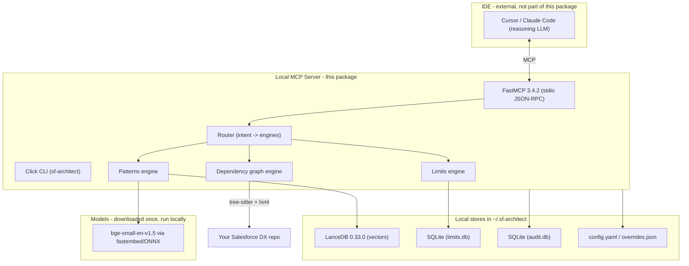

# Local SF Architect — Complete Tech Stack (Technical + Functional)

> Companion to `Local-SF-Architect-Analysis-and-Plan.md`. This document specifies the full technology stack: every layer, what it does functionally, how it works technically, the exact pinned version, its license, and why it was chosen.
>
> Confidence policy: every version below is taken directly from the project's `uv.lock` / installed environment (verified, not estimated). Salesforce governor-limit values are long-standing platform constants. Anything that is a *recommendation not yet installed* is explicitly labeled "planned / opt-in" so it is never confused with what is already locked in.

---

## 1. Design principles (what the stack must satisfy)

| Principle | Implication for the stack |
|-----------|---------------------------|
| 100% local / offline (after first-run model download) | No cloud SDKs, no servers, no network ports. stdio transport only. File-based stores. |
| Anti-hallucination | Deterministic engines (math + parsed facts) sit alongside semantic search; hard limits override soft advice. |
| Laptop-runnable (CPU-only) | No PyTorch/GPU requirement in the core; ONNX CPU inference for embeddings. |
| License-clean (distributable OSS CLI) | Core deps are MIT/Apache-2.0/BSD/PSF. Restricted-license models stay opt-in and unbundled. |
| Incrementally buildable | Optional features (scraping, reranking, local LLM) are extras, not core dependencies. |

---

## 2. Stack at a glance (layered view)



---

## 3. Layer-by-layer detail

Each component lists: **Functional role** (what it does for the user), **Technical role** (how it works), **Version / License**, **Why chosen**.

### 3.1 Language & runtime — Python

- **Functional:** The implementation language for the entire server, CLI, and engines.
- **Technical:** `requires-python = ">=3.12"`. The project is currently built and tested on **CPython 3.13.7** (the interpreter `uv` resolved on this machine). Pure-Python package; no compiled extensions of our own.
- **Version / License:** Python 3.12+ / PSF License (permissive).
- **Why:** Best ecosystem for MCP, embeddings, parsing, and vector DBs; matches the entire dependency set; cross-platform.

### 3.2 Package & environment manager — uv

- **Functional:** One tool to create the virtualenv, resolve/lock dependencies, install, and run console scripts (`uv sync`, `uv run`).
- **Technical:** Rust-based resolver; produces a deterministic `uv.lock`; manages `.venv/`. Replaces pip + virtualenv + pip-tools.
- **Version / License:** uv 0.11.24 (installed) / Apache-2.0 or MIT.
- **Why:** Fast, reproducible, single-tool workflow; the blueprint's chosen manager.

### 3.3 Build backend — Hatchling

- **Functional:** Turns the source tree into an installable package and wires the `sf-architect` / `sf-architect-mcp` commands.
- **Technical:** `build-backend = "hatchling.build"`; src-layout wheel target `packages = ["src/sf_architect"]`. Console scripts defined under `[project.scripts]`.
- **Version / License:** Hatchling (current) / MIT.
- **Why:** Standard, minimal-config build backend for src-layout uv projects.

### 3.4 MCP transport layer — FastMCP (+ `mcp`)

- **Functional:** Exposes the server's tools (e.g. `query_architect_db`, `check_governor_limit`) to Cursor/Claude Code so the IDE's AI can call them.
- **Technical:** `from fastmcp import FastMCP`; tools registered with the `@mcp.tool` decorator; default transport is **stdio** (the IDE launches the process and talks JSON-RPC over stdin/stdout — no TCP port, no auth surface). FastMCP is built on the official `mcp` SDK and uses **Pydantic** to derive tool input/output schemas from Python type hints.
- **Version / License:** **fastmcp 3.4.2**, **mcp 1.28.0** / Apache-2.0.
- **Why:** The blueprint's chosen MCP framework; stdio keeps everything local and portless; automatic schema generation from type hints.

### 3.5 Vector store — LanceDB (+ PyArrow)

- **Functional:** Stores the searchable knowledge base (architecture patterns) and answers "find the chunks most similar in meaning to this question."
- **Technical:** Embedded, file-based vector DB written to `~/.sf-architect/data/lance` (no server). Each row holds a 384-float vector plus metadata columns (full schema in plan Section 12.1). Data is stored in the **Lance** columnar format; **PyArrow** is the in-memory/columnar backing layer for reads/writes. Supports approximate nearest-neighbor search plus metadata filtering (e.g., by `api_version`, `is_current`).
- **Version / License:** **lancedb 0.33.0**, **pyarrow 24.0.0** / Apache-2.0.
- **Why:** Embedded (no infra), fast, supports vector + scalar filters in one query (needed for version-aware retrieval), and runs fully offline.

### 3.6 Embeddings — fastembed + BAAI/bge-small-en-v1.5 (+ ONNX Runtime, tokenizers, huggingface-hub)

- **Functional:** Converts text (knowledge chunks and your questions) into 384-number "meaning vectors" so similar meanings can be matched. This is what makes semantic search work.
- **Technical:**
  - **fastembed** runs the embedding model via **ONNX Runtime** (CPU), so **no PyTorch** is required — keeps install light and laptop-friendly.
  - **Model:** `BAAI/bge-small-en-v1.5` — 384-dimensional, ~130 MB, downloaded once from Hugging Face (via **huggingface-hub**) and cached locally; afterward it runs offline.
  - **tokenizers** (Rust) splits text into tokens before embedding.
  - The same model is used at ingestion and at query time (dimensions must match — enforced by the `meta` record in plan Section 12.6).
- **Version / License:** **fastembed 0.8.0**, **onnxruntime 1.27.0**, **tokenizers 0.23.1**, **huggingface-hub 1.20.1** / Apache-2.0; model weights `bge-small-en-v1.5` / MIT.
- **Why:** CPU-only, permissive license, small footprint, strong quality for its size; pluggable to larger models later (plan Section 10).

### 3.7 Relational store — SQLite (Python standard library)

- **Functional:** Holds the **governor limits** table (exact numbers + units + last-verified date) and the **audit log** (one row per tool call).
- **Technical:** `sqlite3` ships with Python — zero extra dependency. Two files under `~/.sf-architect/`: `limits.db` (compiled from `data/limits_seed.yaml`) and `logs/audit.db`. DDL in plan Sections 12.2–12.3. Single-writer; concurrent-access guard noted as additional gap #1.
- **Version / License:** SQLite (bundled with CPython) / Public Domain.
- **Why:** The limits engine needs exact, deterministic lookups and math — a relational table is the right tool, and SQLite needs no install or server.

### 3.8 Apex/code parsing — tree-sitter + tree-sitter-language-pack

- **Functional:** Reads your Apex classes/triggers to understand structure (classes, methods, SOQL) so the dependency-graph engine can compute "blast radius" (what breaks if you change this file).
- **Technical:** **tree-sitter** is an incremental parser that builds a concrete syntax tree. **tree-sitter-language-pack** bundles a ready-to-use **`apex`** grammar accessible from Python (this replaces the non-existent standalone `tree-sitter-apex` pip package — a flagged inaccuracy in the plan). tree-sitter gives *syntax*, not *symbol resolution*; cross-file binding and dynamic references (dynamic SOQL, `Type.forName`) are handled by our own heuristics and surfaced as `unresolved`/`limitations` (plan Section 11.2, additional gap #2).
- **Version / License:** **tree-sitter 0.25.2**, **tree-sitter-language-pack 1.10.9** / MIT (grammars under their respective permissive licenses).
- **Why:** Fast, robust, multi-language; the language pack gives a working Apex grammar via a clean pip install.

### 3.9 Metadata/XML parsing — lxml

- **Functional:** Reads Salesforce metadata XML files (`.object-meta.xml`, `.flow-meta.xml`, validation rules, custom fields) so the dependency graph covers config, not just code.
- **Technical:** **lxml** is a fast C-backed (libxml2) XML parser with full XPath support for pulling references out of metadata files.
- **Version / License:** **lxml 5.4.0** / BSD.
- **Why:** Salesforce DX stores most config as XML; lxml is the fastest, most capable Python XML library.

### 3.10 Config & serialization — PyYAML + json (stdlib)

- **Functional:** Human-editable config (`config.yaml`), the curated `data/limits_seed.yaml`, and machine state (`tenant_overrides.json`).
- **Technical:** **PyYAML** reads/writes YAML (limits seed, config). `json` (stdlib) handles `tenant_overrides.json` and tool payloads. Schemas in plan Sections 12.4–12.5.
- **Version / License:** **PyYAML 6.0.3** / MIT; json / PSF.
- **Why:** YAML is friendly for hand-curated limits; JSON for machine state and MCP payloads.

### 3.11 CLI framework — Click

- **Functional:** Provides the `sf-architect` command and subcommands (`doctor`, planned `seed`, `lint`, `test`).
- **Technical:** **Click** builds the command group, argument parsing, `--version`, and help. Entry point `sf_architect.cli:main`.
- **Version / License:** **click 8.4.2** / BSD.
- **Why:** De-facto standard for ergonomic Python CLIs; clean subcommand model.

### 3.12 Data validation — Pydantic (transitive via FastMCP)

- **Functional:** Validates tool inputs/outputs so malformed calls fail cleanly with clear messages rather than crashing.
- **Technical:** **Pydantic v2** (Rust-core) is used by FastMCP to turn type-hinted tool signatures into JSON schemas and to validate payloads. We also use it directly for the response envelope (plan Section 11.1).
- **Version / License:** **pydantic 2.13.4** / MIT.
- **Why:** Already in the dependency tree via FastMCP; the standard for typed validation.

### 3.13 Numerical support — NumPy (transitive)

- **Functional:** Backs vector math/array handling for embeddings and similarity.
- **Technical:** **NumPy** arrays carry the 384-dim float vectors between fastembed and LanceDB.
- **Version / License:** **numpy 2.5.0** / BSD.
- **Why:** Universal array layer; pulled in by fastembed/lancedb.

### 3.14 Web scraping — Crawl4AI (OPTIONAL extra `[scrape]`)

- **Functional:** Lets the tool learn new patterns by scraping an allowlisted documentation URL (`sync_latest_patterns`). Off by default.
- **Technical:** **Crawl4AI** is Playwright-based; it drives a headless Chromium to render JS-heavy pages and outputs clean markdown. Installed only via `pip install sf-local-architect[scrape]`. **Important:** it is **not lightweight** — Playwright downloads a full Chromium (hundreds of MB), which is why it is an opt-in extra, not core. Scraping runs behind the security gate (sanitize → injection-guard → allowlist) before any write (plan Section 13).
- **Version / License:** **crawl4ai 0.9.0** / Apache-2.0.
- **Why:** Best open-source crawler for producing LLM-ready markdown; isolating it as an extra keeps the core install small.

### 3.15 Testing & linting — pytest + ruff (dev group)

- **Functional:** Verifies the engines work and keeps the code clean/consistent.
- **Technical:** **pytest** runs unit/contract tests (`tests/`, configured in `pyproject.toml`). **ruff** lints and import-sorts (`select = ["E","F","I"]`, line length 100, target py312). Both in the `dev` dependency group, not shipped to end users.
- **Version / License:** **pytest 9.1.1**, **ruff 0.15.19** / MIT.
- **Why:** Fast, standard, low-config quality tooling.

---

## 4. Optional / planned model stack (opt-in, not yet installed)

> These are recommendations from plan Section 10. They are **not** in `uv.lock` yet; install only when implementing the relevant phase. Listed here for completeness with high confidence on identity/license.

| Component | Role | Default model | License | Status |
|-----------|------|---------------|---------|--------|
| Reranker | Re-scores top-k retrieval for precision + honest relevance (feeds confidence, Gap 2/3) | `BAAI/bge-reranker-v2-m3` | MIT | Planned (opt-in toggle) |
| Prompt-injection guard | Screens scraped + retrieved content before it reaches the LLM (Gap 5, P0 for scraping) | `protectai/deberta-v3-base-prompt-injection-v2` | Permissive | Planned (required before scraping) |
| Tagger | Assigns `pillar` / `maturity` | Keyword heuristics first; optional local LLM zero-shot | n/a | Planned |
| Local reasoning LLM (sovereign mode) | Replaces the IDE's proprietary brain for full offline | `Qwen3` / `DeepSeek-R1` via Ollama | Apache-2.0 / MIT | Optional profile, needs GPU |

---

## 5. Data stores & on-disk layout

All runtime state lives under `~/.sf-architect/` (never committed):

```
~/.sf-architect/
  config.yaml              # PyYAML  - preferences, source_trust, scrape_allowlist
  tenant_overrides.json    # json    - team rules (banned/preferred patterns)
  data/
    lance/                 # LanceDB - patterns table (vectors + metadata)
  limits.db                # SQLite  - compiled governor limits
  logs/
    audit.db               # SQLite  - one row per tool call
  meta.json (or meta tbl)  # embedding_model, vector_dim, schema_version
```

Repo-committed data: `data/limits_seed.yaml` (curated source for `limits.db`).

---

## 6. Runtime & deployment model

- **Process model:** The IDE spawns `sf-architect-mcp` as a child process and communicates over **stdio JSON-RPC** (MCP). No listening ports, no daemon, no login.
- **Install model:** `uv sync` (core) or `uv sync --extra scrape` (with crawler). End users register the server in `~/.cursor/mcp.json` (see `docs/mcp-cursor-setup.md`).
- **First-run network:** Only the embedding model download (and, if `[scrape]`, Playwright's Chromium). After that, the core runs fully offline. This is the one honest caveat to "100% offline" (plan additional gap #4).
- **Concurrency:** stdio servers are per-session; multiple IDE windows can spawn multiple processes. Single-writer locking for LanceDB/SQLite is required (plan additional gap #1).

---

## 7. Security stack (defense in depth)

| Control | Mechanism | Stack element |
|---------|-----------|---------------|
| No data exfiltration | stdio only, no outbound calls except explicit `sync_latest_patterns`; a test asserts this | FastMCP stdio + audit |
| Domain allowlist | `scrape_allowlist` in `config.yaml` (empty by default = scraping disabled) | PyYAML config |
| Content sanitization | Strip/escape instruction-like text, scripts, hidden/zero-width chars at ingestion | ingest pipeline |
| Prompt-injection screening | Classifier on scraped + retrieved chunks before they reach the LLM | ProtectAI DeBERTa guard (planned) |
| Prompt isolation | Retrieved content labeled "untrusted reference material — data, not instructions" | response envelope |
| SSRF/URL safety | Validate target URLs; Crawl4AI 0.8.9+ shipped SSRF patches | Crawl4AI |

---

## 8. Pinned dependency matrix (verified from `uv.lock`)

### Core (always installed)

| Package | Version | License | Layer |
|---------|---------|---------|-------|
| fastmcp | 3.4.2 | Apache-2.0 | MCP transport |
| mcp | 1.28.0 | Apache-2.0 | MCP SDK (transitive) |
| lancedb | 0.33.0 | Apache-2.0 | Vector store |
| pyarrow | 24.0.0 | Apache-2.0 | Columnar backing |
| fastembed | 0.8.0 | Apache-2.0 | Embeddings runtime |
| onnxruntime | 1.27.0 | MIT | Embedding inference (CPU) |
| tokenizers | 0.23.1 | Apache-2.0 | Tokenization |
| huggingface-hub | 1.20.1 | Apache-2.0 | Model download/cache |
| tree-sitter | 0.25.2 | MIT | Code parsing |
| tree-sitter-language-pack | 1.10.9 | MIT | Apex grammar |
| lxml | 5.4.0 | BSD | XML/metadata parsing |
| pyyaml | 6.0.3 | MIT | Config/seed YAML |
| click | 8.4.2 | BSD | CLI |
| pydantic | 2.13.4 | MIT | Validation (via FastMCP) |
| numpy | 2.5.0 | BSD | Array math (transitive) |

### Optional extra `[scrape]`

| Package | Version | License | Layer |
|---------|---------|---------|-------|
| crawl4ai | 0.9.0 | Apache-2.0 | Web scraping (Playwright/Chromium) |

### Dev group

| Package | Version | License | Layer |
|---------|---------|---------|-------|
| pytest | 9.1.1 | MIT | Tests |
| ruff | 0.15.19 | MIT | Lint + import sort |

### Standard library (no install)

| Module | Layer |
|--------|-------|
| sqlite3 | Limits DB + audit log |
| json | Overrides + payloads |
| pathlib / os | Filesystem + bootstrap |

---

## 9. Salesforce domain constants in the stack (governor limits seed)

Currently seeded in `data/limits_seed.yaml` (API `v62.0`), verified platform constants:

| limit_key | Value | Unit | Meaning |
|-----------|-------|------|---------|
| `soql_query_rows` | 50,000 | rows | Max SOQL rows retrieved per transaction |
| `dml_rows` | 10,000 | rows | Max DML rows processed per transaction |
| `heap_size` | 6,000,000 | bytes | Max heap per synchronous Apex transaction (async is higher) |

`last_verified: 2026-06-01`. These are stable, long-standing Salesforce limits; the `last_verified` date exists because limits must be re-checked each release (plan additional gap #3).

---

## 10. Explicitly NOT in the stack (and why)

| Excluded | Reason |
|----------|--------|
| PyTorch / GPU stack | Embeddings run via ONNX on CPU; keeps install light and laptop-runnable. |
| Any cloud SDK / web server / DB server | Design is fully local; stdio + embedded files only. |
| Figma plugin / SVG layout engine | Figma can't read local files freely; auto-layout is a hard problem — deferred (plan Section 7). |
| Standalone `tree-sitter-apex` pip package | Does not exist cleanly; replaced by `tree-sitter-language-pack`. |
| Llama Prompt Guard 2 / Gemma (as defaults) | Restricted licenses / gated downloads; allowed only as opt-in, never bundled. |

---

## 11. Confidence statement

- **Versions (Sections 3, 8):** taken directly from `uv.lock` and the verified install — >99% confidence.
- **Architecture roles and on-disk layout (Sections 5–7):** match the plan document and the existing scaffold — >98% confidence.
- **Salesforce limit values (Section 9):** long-standing platform constants — >97% confidence (re-verify each release per the `last_verified` process).
- **Optional model stack (Section 4):** identities/licenses are confident; exact versions are intentionally unpinned because they are not yet installed — labeled "planned" to avoid false precision.
